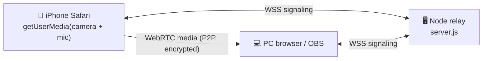

<div align="center">

# 📱 PHONE_CAMERA

### Turn your iPhone into a low‑latency wireless webcam for your PC — **no app, no Mac, built from scratch over WebRTC.**

[](LICENSE)
[](https://nodejs.org)
[](#)
[](#-how-it-works)
[](package.json)
[](#-roadmap)

Open a URL on your iPhone → point the camera → see & hear it live on your PC in **~100–200 ms**, all over your
local Wi‑Fi or a USB cable. Then feed it into **Zoom / Discord / Meet / OBS** as a real camera. No App Store, no
Xcode, no cloud — the phone just uses Safari, and every line of the server is in this repo.

</div>

---

## ✨ Features

| | |
|---|---|
| 📷 **Live camera + mic** | iPhone Safari → PC browser, peer‑to‑peer WebRTC. Zero install on the phone. |
| ⚡ **Sub‑200 ms latency** | Hardware H.264, tunable jitter buffer, a live **latency HUD** (RTT · buffer · fps · loss). |
| 🔌 **Use it as a system camera** | Pipe into **OBS Virtual Camera** → selectable in Zoom, Meet, Discord, Teams, the browser. |
| 🎛️ **Control the phone from the PC** | Quality (480p–1080p / 30–60 fps), bitrate, lens switch, zoom & torch — *capability‑gated* so you only see what your device supports. |
| 📶 **Wi‑Fi or USB** | Same Wi‑Fi, **or** a USB cable (Personal Hotspot link) for rock‑steady, jitter‑free latency. |
| 🔒 **Trusted local HTTPS** | One‑time `mkcert` CA → no browser warnings; everything stays on your LAN. |
| 📲 **Scan‑to‑connect** | The server prints a **QR code** of the phone URL — point the iPhone camera at it, done. |
| 🧰 **One‑command setup** | `setup.ps1` auto‑detects your IP, issues the cert, and launches the server. |

---

## 🎬 How it works

The audio/video flows **directly phone ↔ PC** over WebRTC. The tiny Node server only relays the
connection handshake (signaling) and serves three small web pages — the media never touches it.



| Page | Who opens it | Purpose |
|------|--------------|---------|
| `phone.html`  | iPhone Safari | Captures camera + mic, sends the stream, applies remote controls. |
| `viewer.html` | PC (Chrome/Edge) | Watch live + latency HUD + camera control bar. |
| `source.html` | OBS Browser Source | Clean, UI‑less feed for the virtual camera (served over plain `http://localhost`). |

---

## ⚡ Quick start

> **Requirements:** Windows · [Node.js ≥ 18](https://nodejs.org) · [mkcert](https://github.com/FiloSottile/mkcert) · an iPhone on the **same Wi‑Fi**.

### One command (recommended)

```powershell
powershell -ExecutionPolicy Bypass -File setup.ps1
```

`setup.ps1` downloads mkcert, issues a **trusted** certificate for your LAN IP, installs deps, opens the
firewall port, and starts the server — which prints your URLs **and a scannable QR code**:

```text
  iphone-stream up  (HTTPS + WSS, port 8443)

  PC viewer : https://localhost:8443/viewer.html
  OBS source: http://localhost:8080/source.html   (Browser Source — no cert)

  On the iPhone (same Wi-Fi, OR plugged in via USB), open in Safari:
    phone   : https://192.168.x.x:8443/phone.html

  Scan with the iPhone camera to open the phone URL:
    █▀▀▀▀▀█ ▄▀▄ █▀▀▀▀▀█
    █ ███ █ ▀▄█ █ ███ █     ← real QR printed in your terminal
    █ ▀▀▀ █ █▀█ █ ▀▀▀ █
    ▀▀▀▀▀▀▀ ▀▄▀ ▀▀▀▀▀▀▀
```

### Manual

```bash
npm install
mkcert -install                    # trust a local CA on this PC (one time)
mkcert -cert-file cert/cert.pem -key-file cert/key.pem 192.168.x.x localhost 127.0.0.1
node server.js
```

Then:
1. **PC** (Chrome/Edge) → `https://localhost:8443/viewer.html`
2. **iPhone first time only** → open `https://<your-ip>:8443/rootCA.pem`, install the profile, then
   **Settings → General → About → Certificate Trust Settings → ON**. *(iOS Safari hard‑blocks the camera on an untrusted cert — this is the one required step.)*
3. **iPhone** → scan the QR (or open `phone.html`) → **Start streaming** → Allow.

---

## 🔌 Use it in Zoom / Discord / Meet (OBS Virtual Camera)

Windows has no built‑in virtual camera, so register one with **OBS Studio** (free) and point it at the
clean source page this server hosts on `http://localhost:8080/source.html`:

1. Install **OBS Studio** (this registers the *OBS Virtual Camera* device system‑wide).
2. OBS → **Sources → + → Browser** → URL `http://localhost:8080/source.html`, set 1280×720.
3. Start the iPhone stream → it appears in OBS.
4. OBS → **Start Virtual Camera** → now **“OBS Virtual Camera”** is selectable as a webcam everywhere.

> **Audio:** a virtual camera is video‑only. To expose the iPhone **mic** as an input device, route the
> stream audio through [VB‑CABLE](https://vb-audio.com/Cable/).

---

## 🎛️ Camera controls (from the PC)

The viewer shows a control bar that commands the iPhone live. The phone reports its **real capabilities**
on connect, so you only ever see controls that actually work on your device:

- **Quality** — 480p / 720p / 1080p · 30 / 60 fps *(also your latency‑vs‑sharpness knob)*
- **Bitrate** — 2 / 6 / 12 Mbps
- **Lens** — front / back / ultra‑wide / telephoto (when the device exposes them)
- **Zoom** & **🔦 Torch** — *if supported* (iOS Safari usually hides these — an Apple limitation, not a bug)

---

## 🔌 USB cable mode (most stable latency)

No “USB webcam” exists for iPhone on Windows, but **Personal Hotspot over USB** creates a direct wired IP
link — and the same app runs over it untouched, with **zero Wi‑Fi jitter**.

1. Install the **Apple Devices** app (Microsoft Store) so Windows gets the *Apple Mobile Device Ethernet* adapter.
2. Plug in the iPhone → **Trust** → **Settings → Personal Hotspot → Allow Others to Join = ON**.
3. `ipconfig` → the adapter’s IP is usually `172.20.10.2`. Issue the cert for it and run — the server marks
   that URL `<-- USB cable`. Put both IPs in one cert so Wi‑Fi and cable both work:
   `mkcert ... 192.168.x.x 172.20.10.2 localhost 127.0.0.1`.

---

## 🚀 Latency tuning

WebRTC is already the lowest‑latency browser transport. The build ships tuned for it:

- **Receiver jitter buffer** → `jitterBufferTarget = 0`, with live **0 / 30 / 80 ms** buttons (bump up if it stutters).
- **Latency HUD** → `RTT · jbuf · fps · loss` from `getStats()`, so you tune by numbers.
- **Sender** → hardware **H.264**, `maintain-framerate`, `contentHint = 'motion'`.
- **Physical** → phone on **5 GHz** near the router, PC on Ethernet, or **USB** for zero jitter.

**Reality check:** the floor is ~80–150 ms (sensor + encode + decode + render + one network hop). That part is physics, not a bug.

---

## 🔒 Security

- **LAN‑only by design** — the server binds your local network; nothing is sent to the cloud.
- **Trusted local cert** via `mkcert` (a local CA on your machine), so no browser warnings and iOS accepts the camera.
- **No secrets in this repo** — `cert/` (private keys), `mkcert.exe`, and `node_modules/` are git‑ignored.
- For untrusted networks, add a join PIN (see the roadmap).

---

## 🗺️ Roadmap

**Shipped**

- [x] Live iPhone camera + mic → PC over WebRTC
- [x] Trusted HTTPS via mkcert + one‑command `setup.ps1`
- [x] QR scan‑to‑connect
- [x] USB‑cable (Personal Hotspot) mode
- [x] Latency HUD + jitter‑buffer tuning
- [x] **OBS Virtual Camera** source (use as a system webcam)
- [x] PC‑side camera controls (quality / bitrate / lens / zoom / torch, capability‑gated)

**Planned**

- [ ] Virtual **microphone** (route audio via VB‑CABLE)
- [ ] **RTSP / NDI** re‑publish (`rtsp://<pc>:8554/iphone` for VLC / ffmpeg / vMix)
- [ ] Headless **Python virtual cam** (`aiortc` + `pyvirtualcam`, no OBS window)
- [ ] One‑click **record to MP4** + motion‑triggered auto‑record + time‑lapse
- [ ] **Multi‑camera** (several iPhones, grid + switcher) and multi‑viewer
- [ ] **Two‑way audio** / push‑to‑talk intercom
- [ ] **AI** frame tap — live OCR / document scanner / scene description
- [ ] `/snapshot.jpg` HTTP endpoint · join **PIN** · tray launcher / auto‑start

---

## 🩺 Troubleshooting

| Symptom | Fix |
|---------|-----|
| No camera prompt on the phone / “signaling error” | The CA isn’t trusted yet — install `rootCA.pem` **and** toggle Certificate Trust Settings **ON**. |
| `ERR_CERT_AUTHORITY_INVALID` on the PC | You haven’t run `mkcert -install`, or Chrome cached the old cert — fully restart Chrome. |
| Viewer stuck on “Waiting for phone…” | Firewall blocking port 8443, or phone/PC on different / guest Wi‑Fi, or **AP isolation** is on. |
| Video freezes when the phone locks | Expected — iOS suspends the camera in the background. Keep Safari foreground, screen awake. |
| Torch / zoom controls don’t appear | iOS Safari doesn’t expose them; controls are capability‑gated and hide automatically. |

---

## ❓ FAQ

**Does it need an app on the iPhone?** No — just Safari.
**Does it need a Mac?** No — built entirely for Windows + the iPhone’s browser.
**Does it work without internet?** Yes — it’s LAN‑only (Wi‑Fi or USB). No cloud, no account.
**Can it stream the iPhone *screen*?** Not via Safari (iOS limitation). This is camera + mic. Screen would need AirPlay or a native extension.
**Why must I trust a certificate?** iOS Safari only allows camera access over trusted HTTPS — there’s no “proceed anyway” for it.

---

## 🛠️ Tech stack

Vanilla **WebRTC** (no framework) · **Node.js** + [`ws`](https://github.com/websockets/ws) signaling relay ·
[`qrcode-terminal`](https://github.com/gtanner/qrcode-terminal) · [`mkcert`](https://github.com/FiloSottile/mkcert) for the local CA.
Just **two** runtime dependencies.

---

## 📄 License

[MIT](LICENSE) © 2026 Andrew Altair
